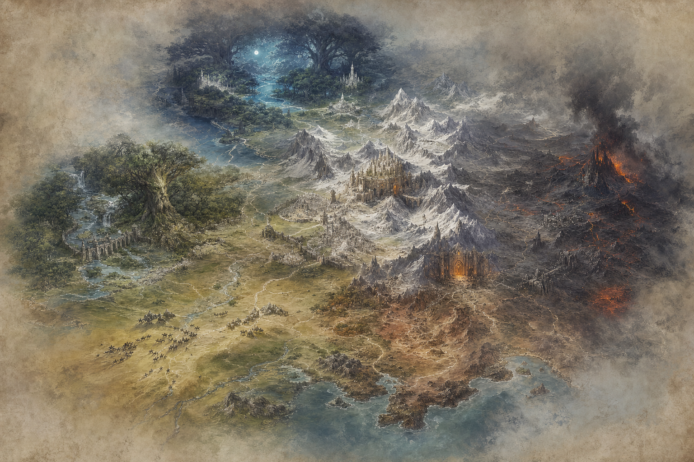
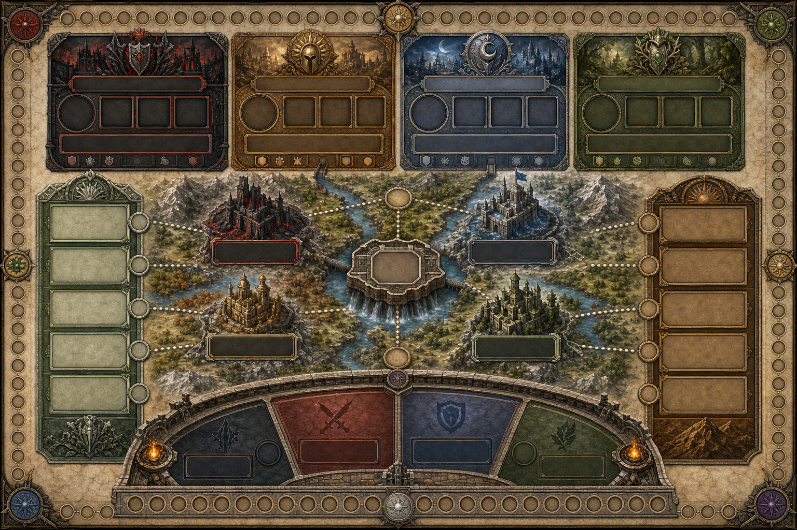

# The War for Middle-earth

*The War for Middle-earth* is an unofficial, non-commercial strategy-game concept about uncertain alliances, hard journeys, secret designs, and armies committed at exactly the right moment. It combines deck-building with agent placement and a contested battle at the end of every round.

This prototype is mechanically inspired by *Dune: Imperium – Uprising*, but its terminology, setting logic, content, and presentation are developed here as an original fan-design exercise. It is not affiliated with, endorsed by, or licensed by Middle-earth Enterprises, the Tolkien Estate, Dire Wolf Digital, or Legendary Entertainment. No generated art in this repository depicts film actors or reproduces published game art.

## Start here

- [VISION.md](VISION.md) states the long-term product and design goals.
- [CONCEPT.md](CONCEPT.md) is the rewritten high-level pitch from the original `wfme.txt`.
- [MAPPING.md](MAPPING.md) records how the reference game's systems and board spaces translate into this setting.
- [RULES.md](RULES.md) is the complete multiplayer prototype ruleset.
- [CARD_CATALOG.md](CARD_CATALOG.md) defines starting cards, leaders, market cards, Fate cards, battles, and War Efforts.
- [BOARD_LAYOUT.md](BOARD_LAYOUT.md) is the production/layout specification for the board.
- [RIVALS.md](RIVALS.md) adds automated opponents for solo and two-player games.
- [ART_DIRECTION.md](ART_DIRECTION.md) records the visual language and generated-asset prompts.
- [assets/README.md](assets/README.md) inventories the image assets.
- [IMPLEMENTATION_PLAN.md](IMPLEMENTATION_PLAN.md) sequences the responsive digital game as vertical slices.
- [IMPLEMENTATION_STATUS.md](IMPLEMENTATION_STATUS.md) is the honest capability ledger for the current construction build.
- [TECHNICAL_DESIGN.md](TECHNICAL_DESIGN.md) defines deterministic state, events, privacy, and responsive rendering.
- [E2E_TESTING.md](E2E_TESTING.md) defines the browser-test, accessibility, and viewport contract.
- [E2E_GUIDE.md](E2E_GUIDE.md) is the short contributor checklist for passing E2E locally and in CI.
- [DEVELOPMENT.md](DEVELOPMENT.md) defines the Nix-first repeatable development and verification environment.

## Current specification scope

Version `0.1` is a paper-prototype specification for 1–4 players, about 45 minutes per player, ages 14+. The 3–4 player competitive game is the foundation; automated Rivals fill the board at one or two players. Six-player team play is intentionally deferred until the core economy and combat loop are stable.

The rules target a ten-round maximum and a 10 Renown endgame threshold. The included catalog has shared starting decks, eight asymmetric leaders, a 54-card Chronicle deck, a 30-card Fate deck, 16 Battle cards, and 12 optional War Efforts.

## Prototype priorities

1. Print plain text cards and use cubes before investing in finished component design.
2. Test whether the seven normal placement icons are equally reachable from a five-card hand.
3. Measure Ent frequency, doubled rewards, and Dam breach timing.
4. Measure the value of Scouts at every observation post.
5. Tune card and board-space numbers without changing several systems at once.

The generated images are mood and composition targets, not print-ready production files. Labels and iconography should be typeset separately during graphic design.

## Play the construction build

The root URL is now the actual game lobby. The construction build supports a real 3–4 player Firebase room, unique power-free Commander identities, deterministic setup, and private starting hands on the production board. Sixteen board destinations and five starting-card Agent boxes are live, including all eight faction destinations, Minas Tirith, Edoras, standing-two Renown, the four standing-four favors and Alliances, ordered optional payment, self-trash, and persistent Scout-placement choices across all nine observation posts. Four complete Battle cards now cover ordinary ranked Combat, the Siege of Minas Tirith, the controller's optional defense of a contested location at Pelennor, face-down White Tree Standard pairing, and control of Edoras at Helm's Deep; Sudden Charge, Hold the Line, Scout-scaled Hidden Archers, garrison-backed Reinforcements, and last-unit Desperate Valor are complete private Combat Fate effects. Edoras accumulates one Mithril through Riches each round that it remains empty, pays its printed and accumulated Mithril to a visitor, and pays an additional tribute to its controller. Pits of Isengard and Deep Roads enforce their full Mithril economies and finite Company recruitment; Hidden Paths provides its private draw; Ranger Mustering pays Provision and exposes an actor-only hand/discard trash choice. Hidden Counsel draws private Fate, resolves the Elven keep-one favor through an authorized choice, and deterministically transfers Fate from opponents who hold four or more without exposing card identities. Mirror of Galadriel requires genuinely earned Mithril, then gains Elven standing, privately draws from the player's deck, and blocks turn advance until its finite Scout is placed. Secret Bargain requires Shadow respect, Gold, and another occupied space; it then offers an authorized opaque Fate cycle, recalls a chosen earlier Agent, draws privately, and makes that Agent usable again. Captain of the Host charges the first player eight Gold and later players six, can be claimed only once per player, and makes a permanent third Agent available at the beginning of the claimant's next turn. A connected Scout can later be recalled either to gather intelligence before its Agent's effects resolve or to infiltrate a destination blocked by another human without replacing that Agent. Hall of Fire draws a private Fate and grants +1 Reveal Influence only while its Agent remains that round. A player with five Gold can take a permanent White Council seat for +2 Reveal Influence; repeat visits pay the same cost for Mithril, a private Fate instance, and Companies. Players can also Reveal, acquire the first Reserve card, discard, Recall, rotate first player, reshuffle, and later draw and use the acquired card. Unimplemented content remains visibly unavailable.

This is a construction build, not yet a playable alpha or complete match. The exact boundary is recorded in [IMPLEMENTATION_STATUS.md](IMPLEMENTATION_STATUS.md).

To play locally against the Auth and Firestore emulators:

```sh
nix develop --command bun install --frozen-lockfile
nix develop --command bun run emulators
```

In a second terminal run `nix develop --command bun run dev`, open `http://127.0.0.1:5189/` in three separate browser profiles or private contexts, and create/join the same room. The retained PR preview uses the live Firebase project and needs no local setup.

Run every local gate with:

```sh
nix develop --command bun run verify:change
```

The Linux workflow and the separate `E2E tests (macOS)` workflow are independent
required checks: Linux runs static/unit/build verification, while macOS runs the
complete Playwright gate and owns future visual baselines. No check is skipped.
See [E2E_GUIDE.md](E2E_GUIDE.md) for the exact local command and review rules.

The deployment workflow publishes each same-repository pull request with the live Firebase configuration as a retained
GitHub Pages preview at `https://anicolao.github.io/wfme/pr<N>/` and links it from
the PR conversation. A push to `main` publishes the production site at
`https://anicolao.github.io/wfme/`. Fork pull requests are fully verified but are
not deployed because they cannot safely receive the repository write token.

## Visual direction




