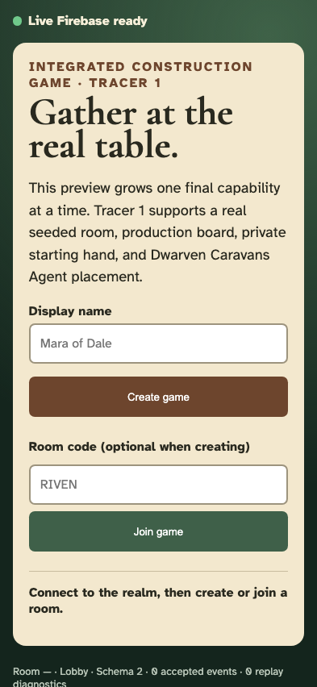
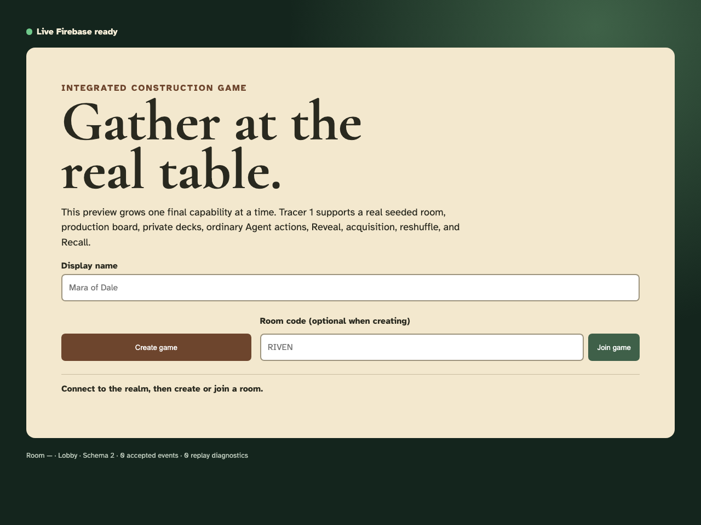

# Test: Responsive construction lobby

A human arrives at the root URL and can begin a real multiplayer game without navigating through an advertisement or prototype index.

Every numbered frame is captured only after its listed semantic validations pass. The phone and desktop images prove the same gesture at both required viewports.

## The game opens at the playable lobby

**Verifications:**

- [x] The page is the game, not a marketing interstitial
- [x] The Firebase session is ready before room controls are enabled
- [x] A player can immediately create or join a room
- [x] The current tracer boundary is explicit
- [x] The viewport has no horizontal document overflow

---
