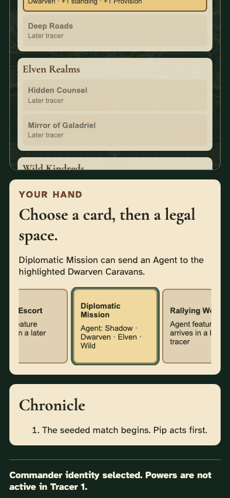
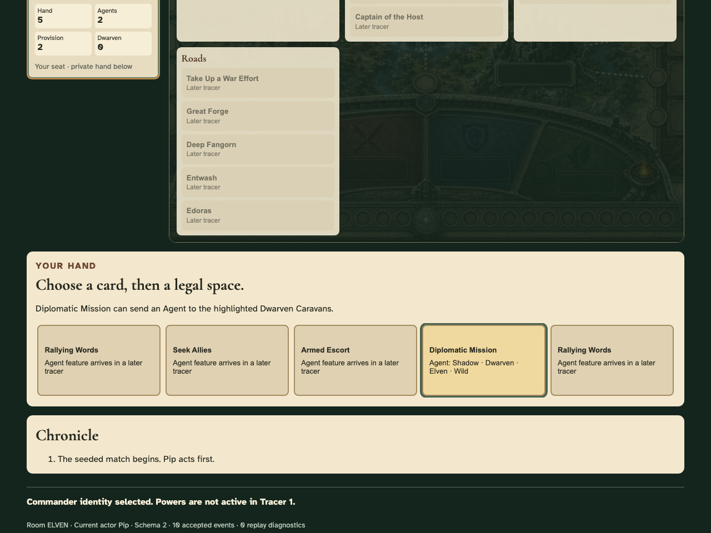
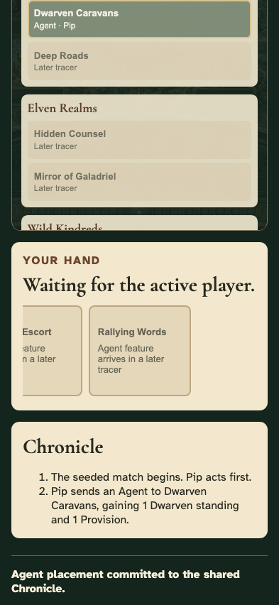
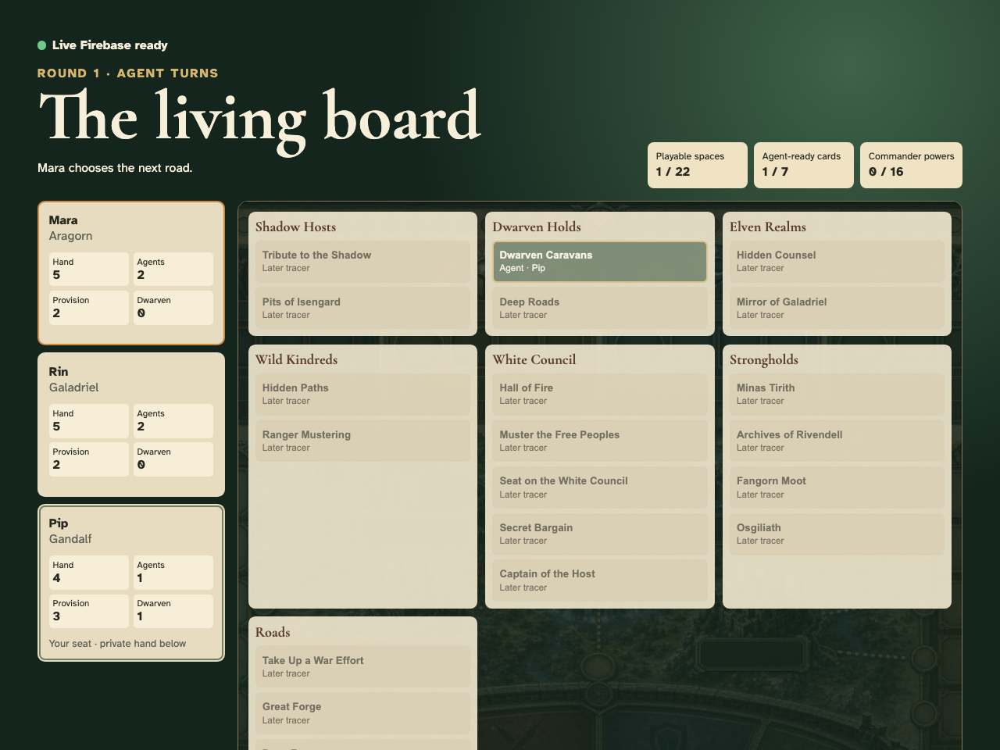
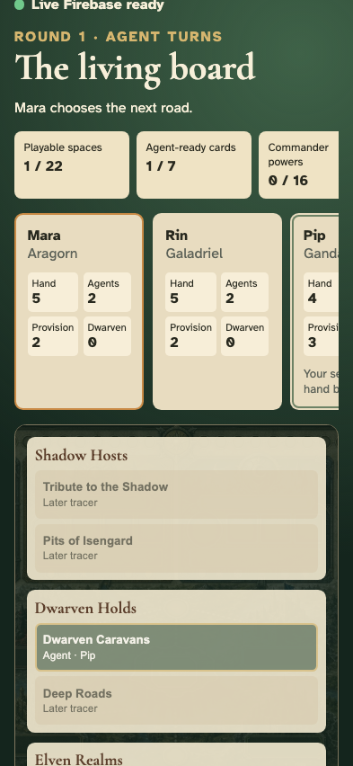

# Test: Three-player Dwarven Caravans tracer

Three isolated human browser sessions create and join a Firebase room, choose power-free Commander identities, start a seeded game on the final board, resolve one legal Agent action, converge, and replay it after reload.

Every numbered frame is captured only after its listed semantic validations pass. The phone and desktop images prove the same gesture at both required viewports.

## Mara enters a table name

**Verifications:**

- [x] The entered name is visible and the create action remains available

---

## Mara chooses a private invitation code

**Verifications:**

- [x] The five-character code is entered through the real lobby control

---

## Mara creates the shared room

**Verifications:**

- [x] The requested invitation code is displayed
- [x] All connected seats converge on 1 public player
- [x] Every connected replay has accepted exactly 1 events with no diagnostics

---

## Rin enters a table name

**Verifications:**

- [x] Rin's name is visible

---

## Rin enters the room code

**Verifications:**

- [x] The exact host invitation code is entered

---

## Rin joins from an independent browser

**Verifications:**

- [x] Rin receives a real seat in the room
- [x] All connected seats converge on 2 public players
- [x] Every connected replay has accepted exactly 2 events with no diagnostics

---

## Pip enters a table name

**Verifications:**

- [x] Pip's name is visible

---

## Pip enters the room code

**Verifications:**

- [x] The exact host invitation code is entered

---

## Pip joins from an independent browser

**Verifications:**

- [x] Pip receives a real seat in the room
- [x] All connected seats converge on 3 public players
- [x] Every connected replay has accepted exactly 3 events with no diagnostics

---

## Mara claims Aragorn

**Verifications:**

- [x] Aragorn is selected for Mara
- [x] Commander powers are visibly identified as inactive
- [x] Every connected replay has accepted exactly 4 events with no diagnostics

---

## Mara readies their seat

**Verifications:**

- [x] Mara's public row reports Ready
- [x] Every browser converges on the same ready state
- [x] Every connected replay has accepted exactly 5 events with no diagnostics

---

## Rin claims Galadriel

**Verifications:**

- [x] Galadriel is selected for Rin
- [x] Commander powers are visibly identified as inactive
- [x] Every connected replay has accepted exactly 6 events with no diagnostics

---

## Rin readies their seat

**Verifications:**

- [x] Rin's public row reports Ready
- [x] Every browser converges on the same ready state
- [x] Every connected replay has accepted exactly 7 events with no diagnostics

---

## Pip claims Gandalf

**Verifications:**

- [x] Gandalf is selected for Pip
- [x] Commander powers are visibly identified as inactive
- [x] Every connected replay has accepted exactly 8 events with no diagnostics

---

## Pip readies their seat

**Verifications:**

- [x] Pip's public row reports Ready
- [x] Every browser converges on the same ready state
- [x] Every connected replay has accepted exactly 9 events with no diagnostics

---

## The host starts the deterministic match

**Verifications:**

- [x] All three browsers transition to the production board
- [x] All 22 final board destinations are structurally present
- [x] Only Dwarven Caravans is advertised as playable
- [x] Each seat exposes exactly its own five-card hand
- [x] Every connected replay has accepted exactly 10 events with no diagnostics

---

## Pip chooses Diplomatic Mission

**Verifications:**

- [x] Diplomatic Mission is visibly selected
- [x] Dwarven Caravans becomes the sole legal enabled destination

---

## Pip sends an Agent to Dwarven Caravans

**Verifications:**

- [x] Every player sees the same named Agent occupation
- [x] The acting seat gains exactly one Provision and one Dwarven standing
- [x] The Chronicle narrates the resolved shared action
- [x] The turn advances to another human

---

## Pip reloads and the immutable history replays

**Verifications:**

- [x] The anonymous seat reconnects directly to the board
- [x] The committed Agent and rewards survive reload

---
