# Test: Solo Rivals

One isolated human configures a Captain-difficulty solo table, receives two distinct automated opponents and public Objectives, completes an ordinary Reveal, watches every Rival Agent and Battle step resolve, and reloads the deterministic round-two state.

Every numbered frame is captured only after its listed semantic validations pass. The phone and desktop images prove the same gesture at both required viewports.

## Mara enters the solo table name

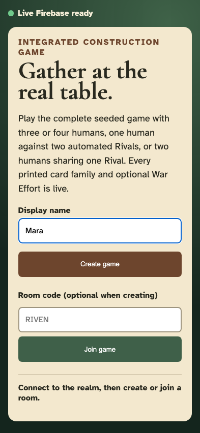

**Verifications:**

- [x] The local identity is retained

---

## Mara enters a private solo room code

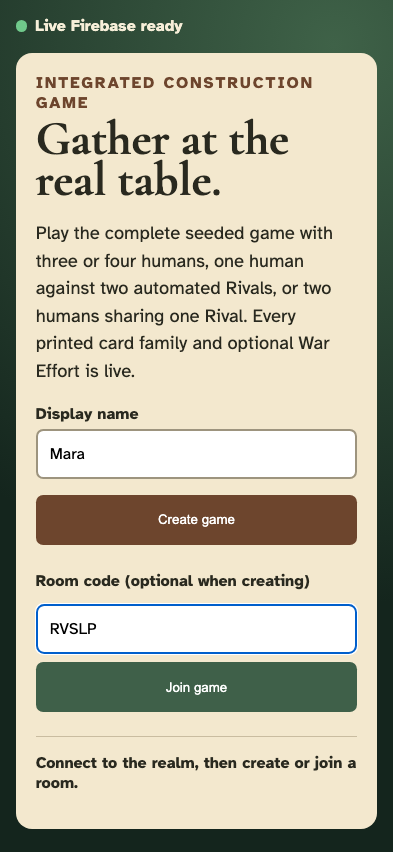

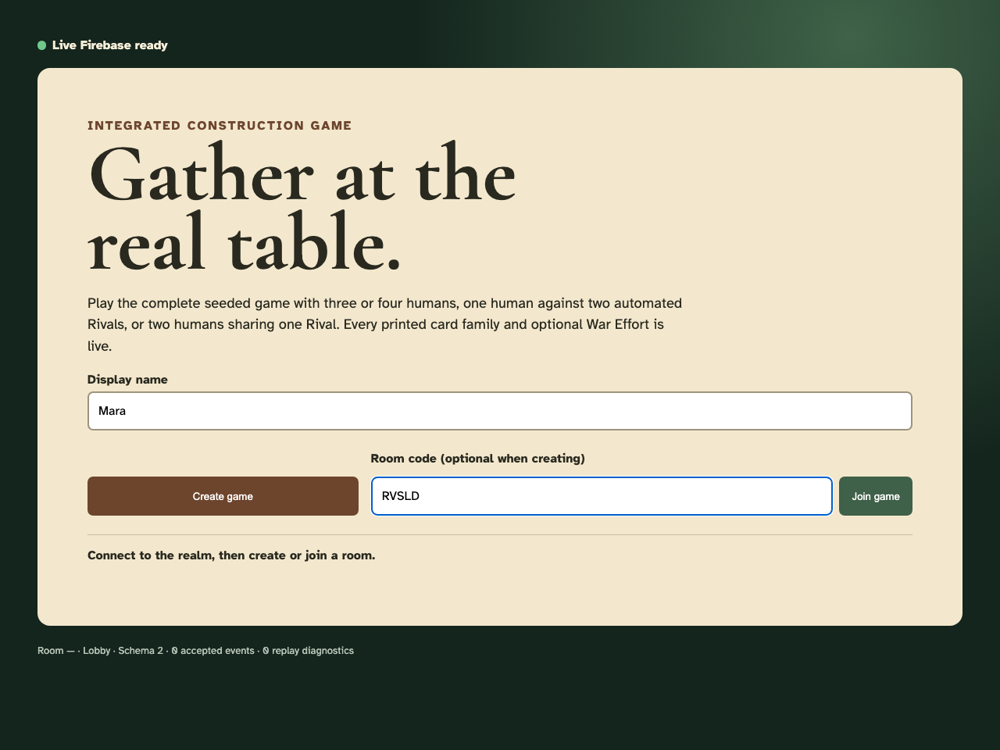

**Verifications:**

- [x] The exact private invitation is visible

---

## Mara creates the solo room

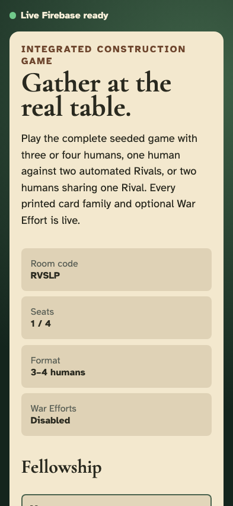

**Verifications:**

- [x] The requested room opens
- [x] 1 accepted events replay with no diagnostics

---

## Mara selects one human against two Rivals

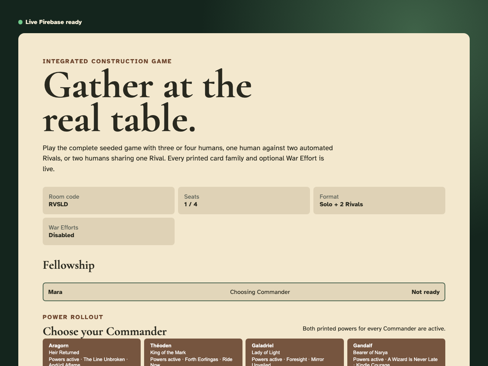

**Verifications:**

- [x] The lobby publishes the solo format and Captain difficulty
- [x] 2 accepted events replay with no diagnostics

---

## Mara selects Aragorn

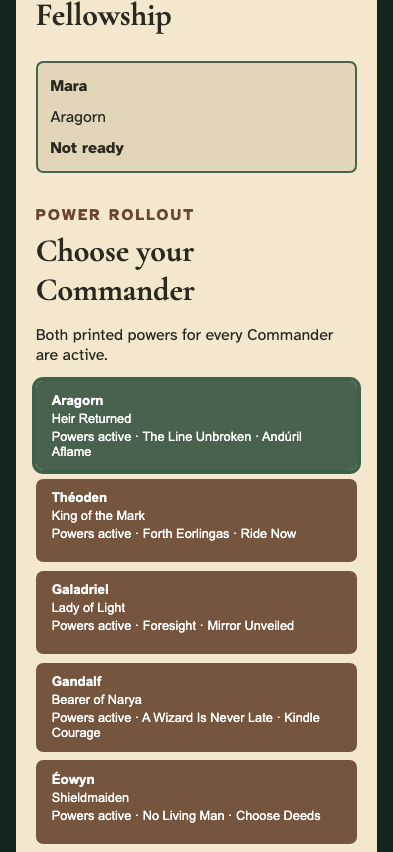

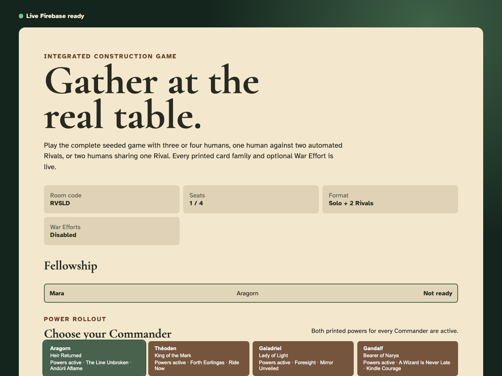

**Verifications:**

- [x] Aragorn is the unique selected human identity
- [x] 3 accepted events replay with no diagnostics

---

## Mara readies the solo table

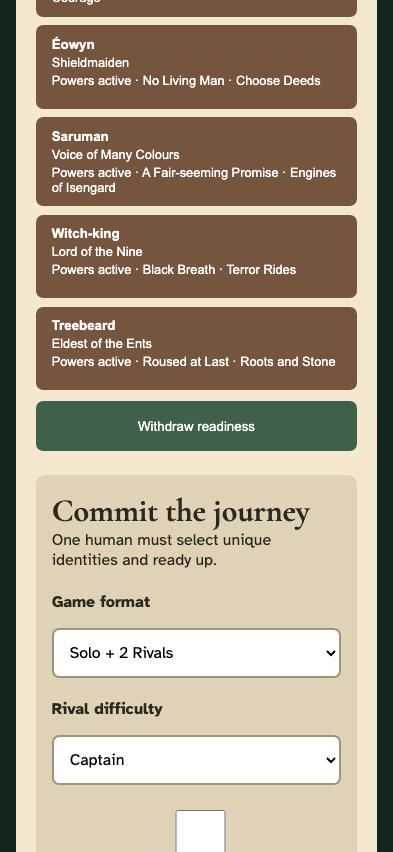

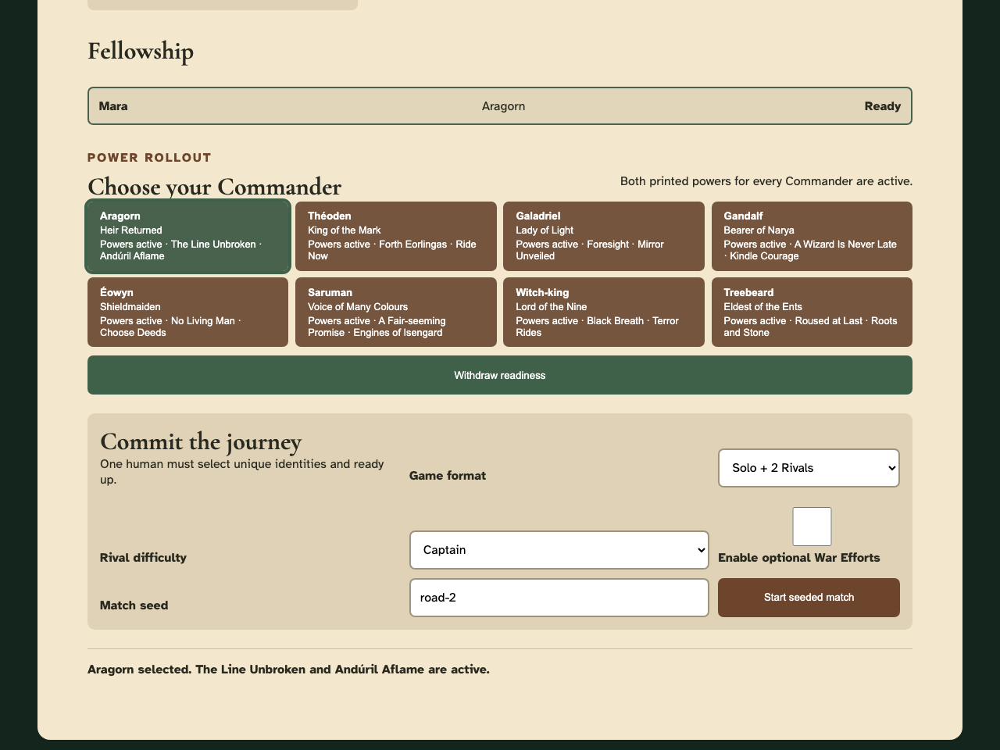

**Verifications:**

- [x] One ready human satisfies the solo player count
- [x] 4 accepted events replay with no diagnostics

---

## Mara publishes the Rival seed

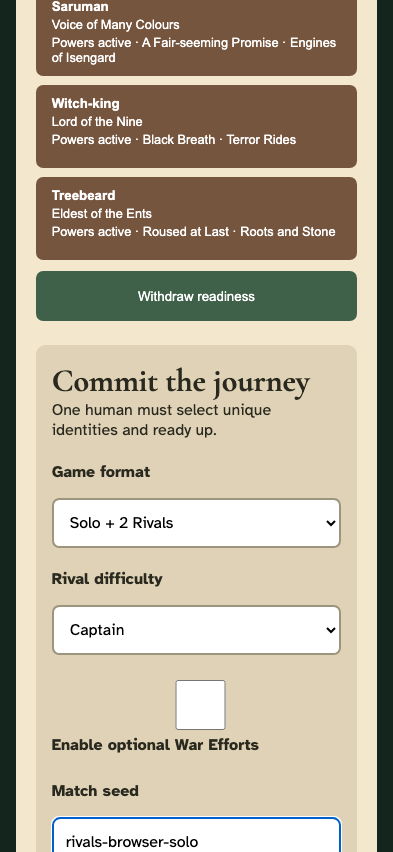

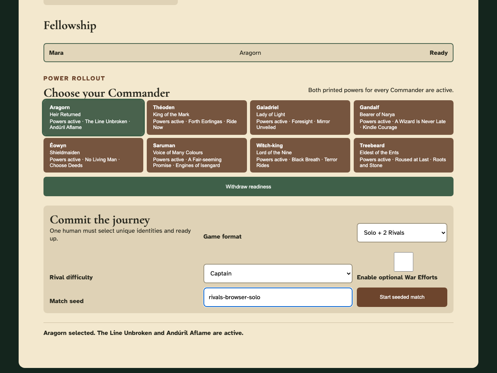

**Verifications:**

- [x] The deterministic seed is visible

---

## Mara starts the solo match

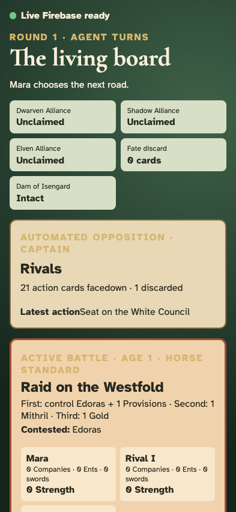

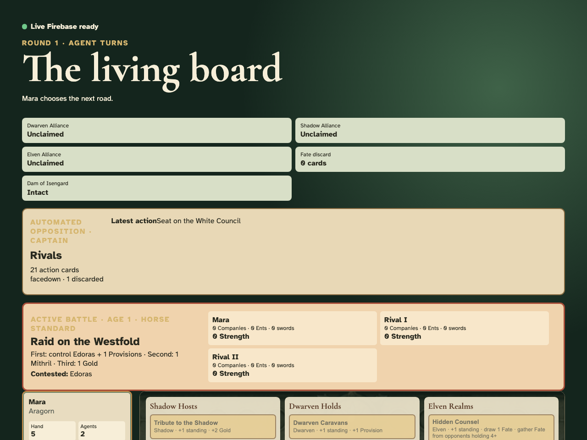

**Verifications:**

- [x] The board shows one human and two distinct public Rival profiles
- [x] All three participants have a public Objective and the shared action deck is visible
- [x] 5 accepted events replay with no diagnostics

---

## Mara Reveals instead of placing an Agent

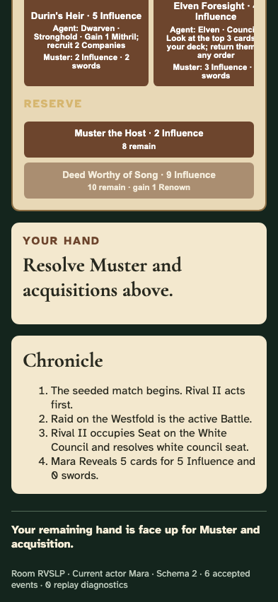

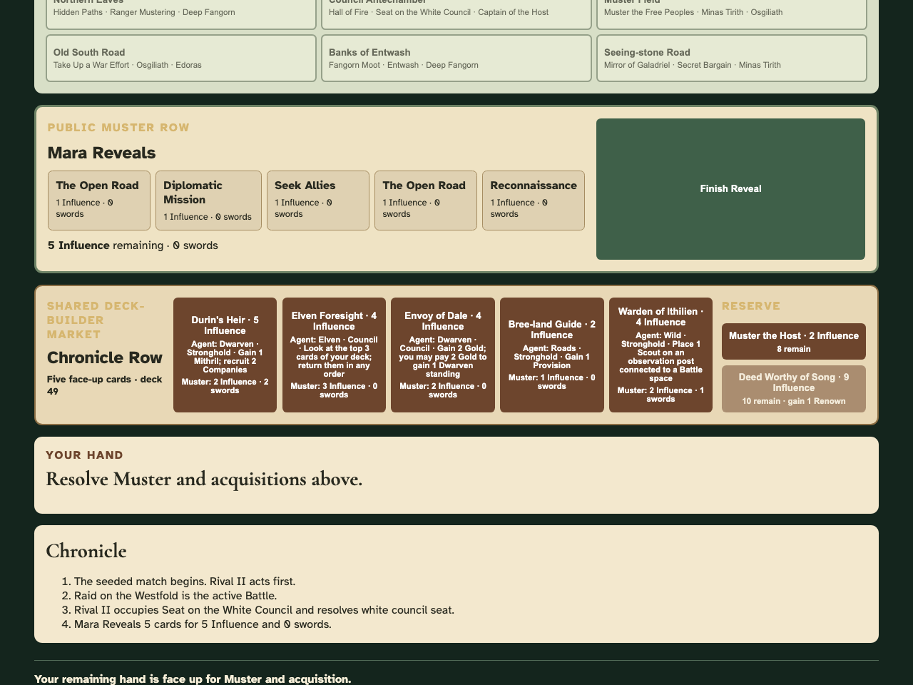

**Verifications:**

- [x] The ordinary human Reveal remains interactive
- [x] 6 accepted events replay with no diagnostics

---

## Mara finishes Reveal and the Rivals complete the round automatically

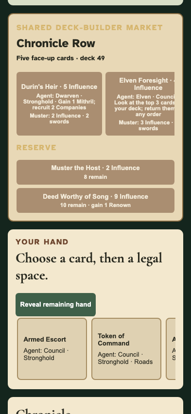

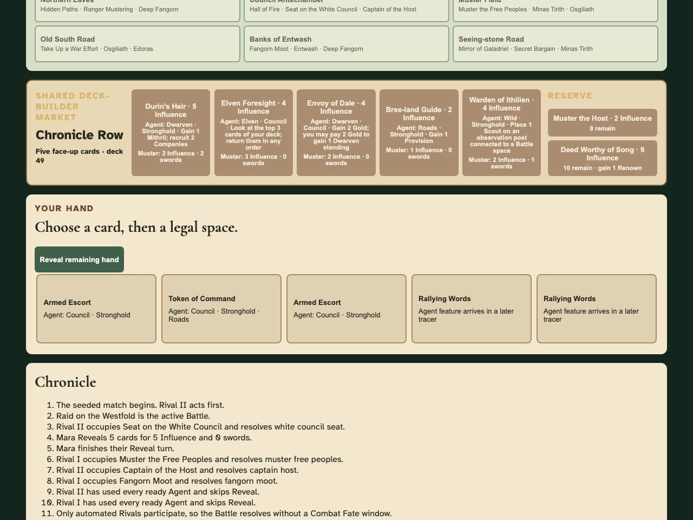

**Verifications:**

- [x] Both Rivals use their ready Agents, skip Reveal and resolve Battle without synthetic client events
- [x] 7 accepted events replay with no diagnostics

---

## Mara reloads the automated round

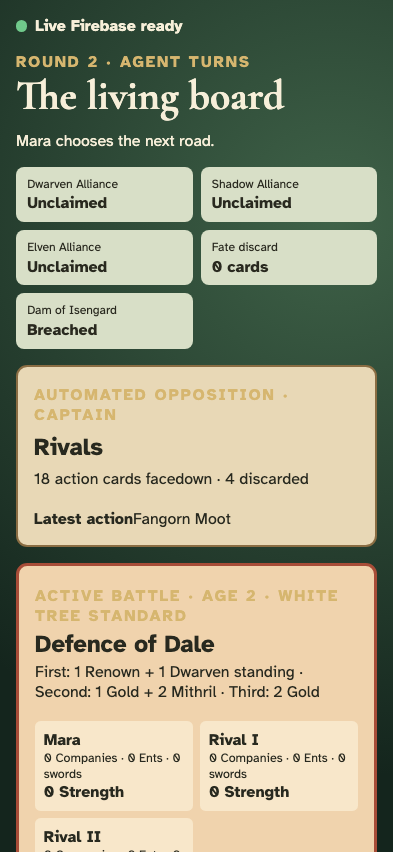

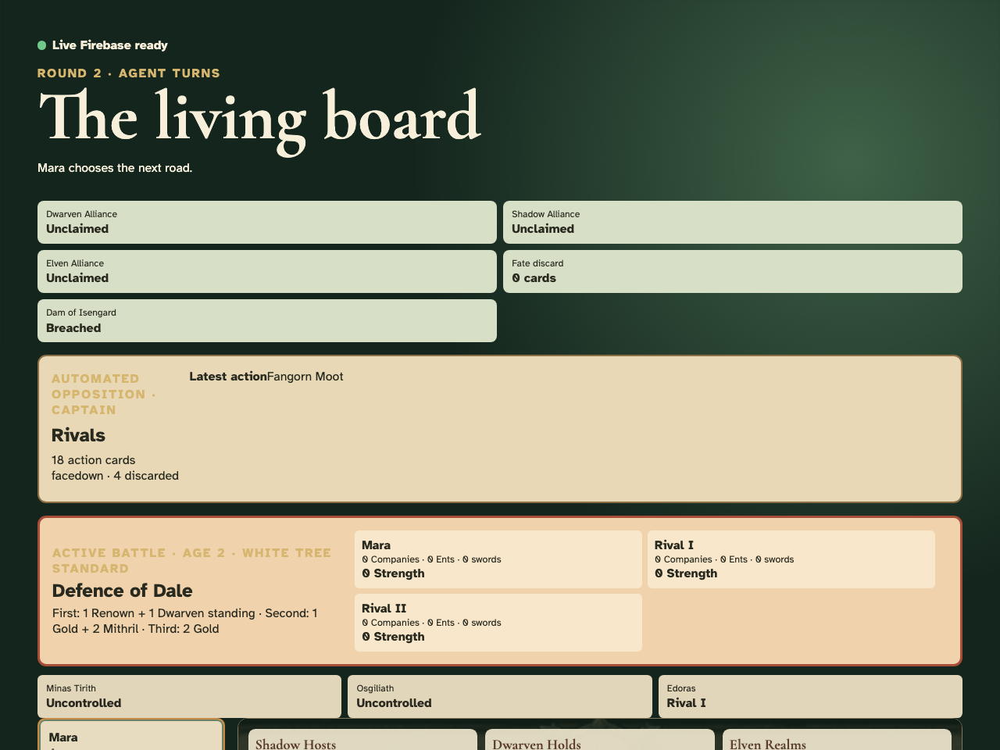

**Verifications:**

- [x] Immutable replay restores the same round, profiles, resources, Objectives and action deck
- [x] 7 accepted events replay with no diagnostics

---
